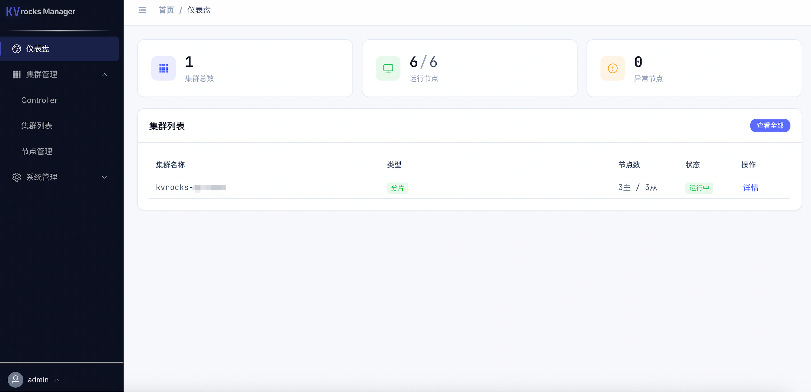
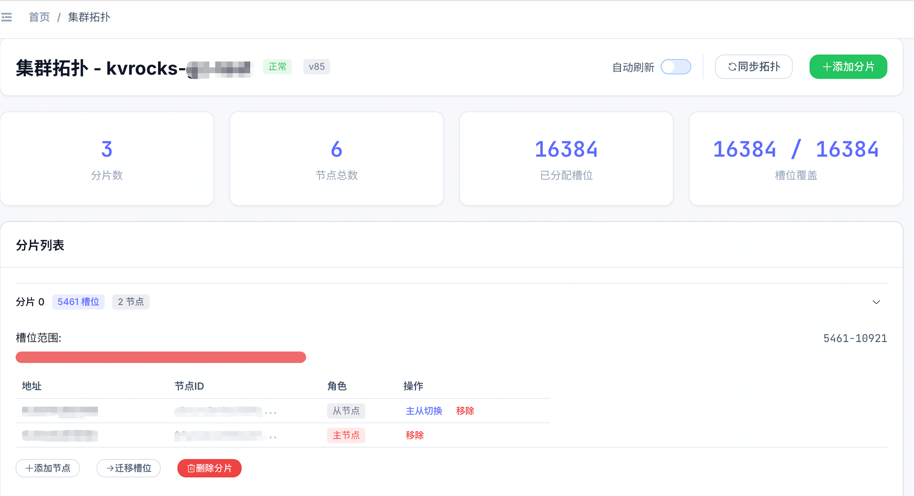

# KVrocks Manager

A full-stack web platform for managing [Apache KVrocks](https://github.com/apache/kvrocks) clusters. Supports cluster CRUD, node management, scaling operations, KVrocks Controller integration, and role-based access control.

## Features

- **Cluster Management** — Create and manage Master-Slave and Sharding clusters, real-time node status, topology visualization
- **Scaling Operations** — Failover, add/remove shards, slot migration, add/remove nodes with full operation history
- **Controller Integration** — Register KVrocks Controllers, discover and import existing clusters, sync topology
- **Node Management** — Add/remove nodes, view configurations, execute commands, monitor health
- **RBAC** — Built-in roles (super_admin, cluster_admin, operator, readonly) with granular `module:action` permissions
- **Dashboard** — Overview of cluster/node counts and status at a glance

## Overview





## Tech Stack

| Layer | Technology |
|-------|-----------|
| Backend | FastAPI, SQLAlchemy 2.0 (async), Python 3.11 |
| Frontend | Vue 3 (Composition API), Vite 5, Element Plus, Pinia, ECharts |
| Database | MySQL 8.0 (production), SQLite (development) |
| Cache | Redis 7 |
| Deployment | Docker Compose, Nginx, Gunicorn |

## Quick Start

### Docker Compose (Recommended)

```bash
# Clone the repository
git clone https://github.com/Songdantes/kvrocks-manager.git
cd kvrocks-manager

# Configure environment
cp .env.example .env
# Edit .env — set SECRET_KEY, MYSQL_ROOT_PASSWORD, MYSQL_PASSWORD

# Build and start
docker compose up -d
```

Services will be available at:
- Frontend: http://localhost
- Backend API: http://localhost:8000
- API Docs: http://localhost:8000/docs

Default login: `admin` / `admin123`

### Local Development

**Backend:**

```bash
cd backend
python -m venv venv && source venv/bin/activate
pip install -r requirements.txt
python -m app.main  # Runs on :8000 with auto-reload
```

The backend uses SQLite by default for local development. Set `DATABASE_URL` env var to use MySQL.

**Frontend:**

```bash
cd frontend
npm install
npm run dev  # Runs on :3000, proxies /api to :8000
```
## Configuration

All backend configuration is environment-driven via `backend/app/config.py`. Key variables:

| Variable | Description | Default |
|----------|-------------|---------|
| `DATABASE_URL` | Database connection string | `sqlite+aiosqlite:///./kvrocks_manager.db` |
| `SECRET_KEY` | JWT signing key | *(required in production)* |
| `REDIS_URL` | Redis connection | `redis://localhost:6379/0` |
| `KVROCKS_CONTROLLER_URL` | Controller endpoint (optional) | *(none)* |
| `KVROCKS_DEFAULT_NAMESPACE` | Default controller namespace | `default` |

## API Overview

All routes are under the `/api` prefix. Authentication uses JWT Bearer tokens.

| Module | Endpoints | Description |
|--------|-----------|-------------|
| `/api/auth` | login, logout, me, refresh | Authentication |
| `/api/clusters` | CRUD + status refresh | Cluster management |
| `/api/nodes` | CRUD + operations | Node management |
| `/api/clusters/{id}/scaling` | topology, failover, add/remove shard, migrate slots, tasks | Scaling operations |
| `/api/controllers` | CRUD + discover, import, health check | Controller integration |
| `/api/users` | CRUD + password management | User management |
| `/api/roles` | CRUD | Role management |
| `/api/permissions` | list | Permission listing |

Full interactive API documentation is available at `/docs` (Swagger UI) when the backend is running.

## Scaling Operations

For sharding clusters managed by a [KVrocks Controller](https://github.com/apache/kvrocks-controller):

| Operation | Description |
|-----------|-------------|
| Failover | Promote a slave node to master |
| Add Shard | Add a new shard with master and optional slaves |
| Remove Shard | Remove a shard (migrates slots to remaining shards first) |
| Slot Migration | Move slot ranges between shards |
| Add/Remove Node | Scale individual shards horizontally |

All scaling operations are tracked with detailed execution logs.

## RBAC

Built-in roles with configurable permissions:

| Role | Access Level |
|------|-------------|
| `super_admin` | Full access (implicit) |
| `cluster_admin` | Cluster/node/scaling CRUD, backup, command execution |
| `operator` | Read + operate nodes, execute commands, view tasks |
| `readonly` | Read-only access to all resources |

Custom roles can be created with any combination of permissions.

## Deployment

### Docker Compose

See `docker-compose.yml` for the full stack setup. Requires a `.env` file with database passwords and secret key.

### Manual Deployment

```bash
./deploy/deploy.sh manual
```

This sets up:
- Python venv with gunicorn
- Systemd service for the backend
- Nginx reverse proxy
- Frontend static build

See `deploy/` directory for configuration files.

## License

[Apache License 2.0](LICENSE)
